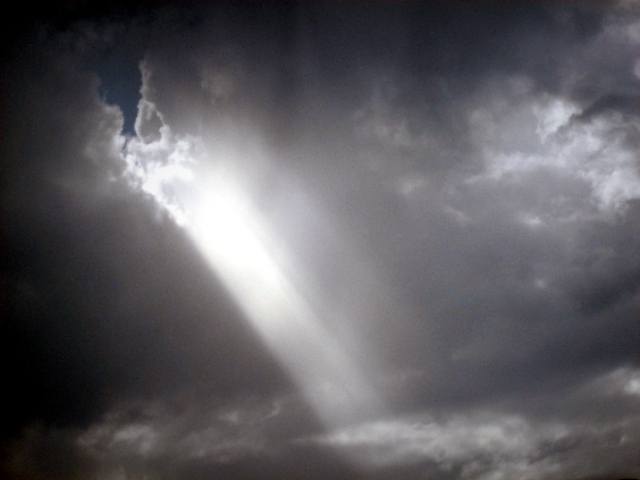
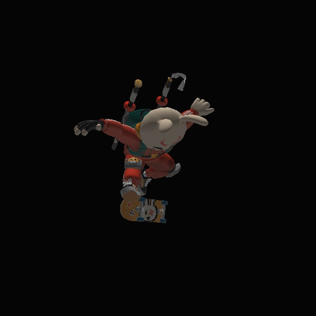
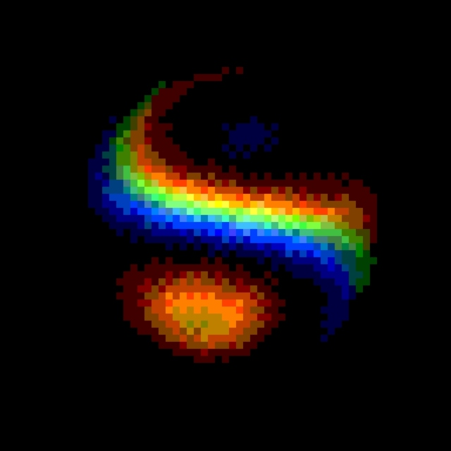
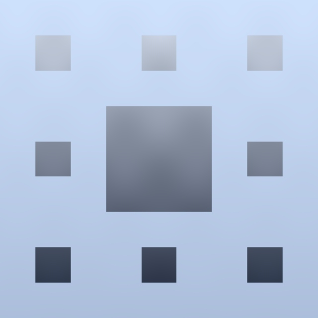
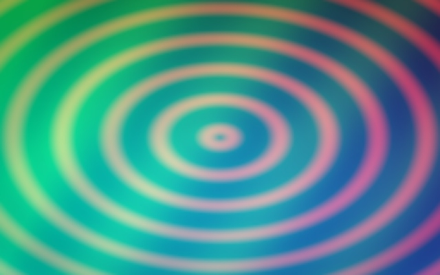

..
  SPDX-License-Identifier: Apache-2.0

Examples
========

This page groups the workflow shapes that come up repeatedly in RawGL.

Each section is labeled by source:

- ``Script`` means there is a checked-in runnable example
- ``Test`` means there is a checked-in smoke test or batch file
- ``Pattern`` means the code block is a short usage sketch built from the
  current public API

Single-pass workflows
=====================

Metadata inspection
-------------------

Source: ``Script``

Run ``examples/Metadata/ReadMetadata.py`` for a checked-in file-oriented
metadata example.

It loads ``tests/inputs/sky.jpg``, reads the source EXIF metadata, reads the
same metadata into a typed RawGL document, and writes TIFF, JPEG, PNG, and EXR
copies with source metadata transferred into each target.

.. code-block:: python

   from pathlib import Path

   import rawgl

   source_path = Path("tests/inputs/sky.jpg")
   output_path = Path("examples/Metadata/ReadMetadata_transfer_python.tif")

   image = rawgl.io.load_image(source_path)
   document = rawgl.io.read_metadata_document(
       source_path,
       name_style=rawgl.MetadataNameStyle.oiio,
       name_policy=rawgl.MetadataNamePolicy.exif_tool_alias,
   )

   rawgl.io.save_image(image, output_path, bits=16, source_metadata=document)
   print(len(document.fields))

Use this shape when metadata is part of the file-oriented pipeline but not part
of the shader execution itself.

Image generation
----------------

Source: ``Script``

Run ``examples/EmptyLUT/EmptyLUTGen.py`` for the smallest self-contained
image-generation example in the repository.

It uses one fragment shader, the built-in fullscreen quad vertex path, and one
output file.

.. code-block:: python

   import rawgl

   result = rawgl.io.image(
       fragment_shader,
       size=512,
       inputs={
           "img_size": 512,
           "lut_size": 8,
       },
       output="EmptyLUT.png",
   )

   if not result.success:
       raise RuntimeError(result.error_message)

Use this shape when the shader generates an image from uniforms alone and the
workflow still starts or ends with a file.

Related repo files:

- ``examples/EmptyLUT/EmptyLUTGen.py``
- ``examples/EmptyLUT/EmptyLUTGen.bat``
- ``examples/EmptyLUT/EmptyLUT.frag``

Image processing
----------------

Source: ``Script``

Run ``examples/ImageProcessing/AdjustImage.py`` for a checked-in single-pass
image-processing example.

It reads ``tests/inputs/sky.jpg``, applies a simple gain and gamma adjustment in one fragment
pass, and writes one PNG.

.. code-block:: python

   import rawgl

   input_path = "tests/inputs/sky.jpg"
   loaded = rawgl.io.load_image(input_path)
   width, height = loaded.width, loaded.height

   result = rawgl.io.image(
       fragment_shader,
       size=(width, height),
       inputs={
           "u_src0": input_path,
           "gain": 1.20,
           "gamma_value": 1.10,
       },
       output={
           "path": "AdjustImage_python.png",
           "format": "rgba32f",
           "channels": 4,
           "alpha_channel": 3,
           "bits": 16,
           "capture_to_host": True,
       },
   )

   image = result.captured_outputs["OutImage::0"]

Use ``rawgl.io.prepare_image(...)`` instead of ``rawgl.io.image(...)`` when the
same shader runs many times with new images or new uniform values.

Source image:

Adjusted result:

Related repo files:

- ``examples/ImageProcessing/AdjustImage.py``
- ``tests/python/rawgl_python_workflow_smoke.py`` covers direct NumPy input and captured-array output.

NumPy production-style image processing
---------------------------------------

Source: ``Script``

Run ``examples/NumPy/NumpyTypedIoPipeline.py`` for a Python-side processing
example that keeps image data in NumPy until the RawGL shader pass.

The script loads ``tests/inputs/sky.jpg`` with typed native JPEG load options,
converts it to a contiguous ``float32`` RGB array, downsamples it to a practical
working size, applies vectorized NumPy normalization/vignette preparation, runs
one RawGL fullscreen shader pass, then writes PNG, tiled TIFF, and tiled OpenEXR
using typed codec save options.

.. code-block:: python

   import rawgl

   jpeg = rawgl.io.JpegLoadOptions()
   jpeg.has_color_transform = True
   jpeg.color_transform = rawgl.io.JpegLoadColorTransform.rgb

   load_codec = rawgl.io.ImageCodecLoadOptions()
   load_codec.has_backend_policy = True
   load_codec.backend_policy = rawgl.io.ImageLoadBackendPolicy.native_only
   load_codec.has_jpeg = True
   load_codec.jpeg = jpeg

   image = rawgl.io.load_image("tests/inputs/sky.jpg", codec_options=load_codec)
   source_array = rawgl.host_image_to_array(image)  # Convert to NumPy and process there.

   result = rawgl.image(
       fragment_shader,
       size=(source_array.shape[1], source_array.shape[0]),
       inputs={"u_src0": source_array},
       output={"format": "rgba32f", "channels": 4, "capture_to_host": True},
   )

   exr = rawgl.io.OpenExrSaveOptions()
   exr.has_compression = True
   exr.compression = rawgl.io.OpenExrCompressionMode.zip

   save_codec = rawgl.io.ImageCodecSaveOptions()
   save_codec.has_openexr = True
   save_codec.openexr = exr

   rawgl.io.save_image(
       result.captured_outputs["OutImage::0"],
       "NumpyTypedIoPipeline_python.exr",
       bits=16,
       codec_options=save_codec,
   )

This is the current reference shape for pipelines that already produce arrays
with NumPy, scikit-image, OpenCV, or similar Python preprocessing stages.

Typed IO result:

Related repo file:

- ``examples/NumPy/NumpyTypedIoPipeline.py``

Mesh rendering
--------------

Source: ``Test`` for the CLI example, ``Pattern`` for the Python equivalent.

Mesh rendering currently sits on the explicit workflow-builder path rather than
the very small ``rawgl.image(...)`` helper layer.

The validated file-oriented CLI path is in ``tests/test_mesh_ao_sponge.bat``.
RawGL accepts PLY and OBJ mesh files on this path:

.. code-block:: bat

   RawGL.exe ^
     --verbosity 5 ^
     --pass_vertfrag tests\shaders\mesh_ao.vert tests\shaders\mesh_ao.frag ^
     --pass_size 256 256 ^
     --bg_color 0 0 0 1 ^
     --pass_mesh mesh tris true rend tr tests\inputs\sponge.ply ^
     --out OutSample tests\outputs\mesh_ao_sponge.exr ^
     --out_format rgba32f ^
     --out_channels 4 ^
     --out_alpha_channel 3 ^
     --out_bits 32

The same workflow shape is available in Python through ``render_pass(...)``:

.. code-block:: python

   import rawgl

   workflow = rawgl.build_workflow(
       rawgl.render_pass(
           "tests/shaders/mesh_ao.frag",
           vertex_shader="tests/shaders/mesh_ao.vert",
           size=(256, 256),
           meshes=[
               {
                   "path": "tests/inputs/sponge.ply",
                   "parameters": {
                       "tris": "true",
                       "rend": "tr",
                   },
               }
           ],
           outputs={
               "OutSample": {
                   "format": "rgba32f",
                   "channels": 4,
                   "alpha_channel": 3,
                   "bits": 32,
                   "capture_to_host": True,
               }
           },
       ),
       verbosity=0,
   )

   result = rawgl.run_workflow(workflow)
   rawgl.save_image(result.captured_outputs["OutSample::0"], "tests/outputs/mesh_ao_sponge.exr", bits=32)

Related repo files:

- ``tests/test_mesh_ao_sponge.bat``
- ``tests/shaders/mesh_ao.vert``
- ``tests/shaders/mesh_ao.frag``
- ``tests/rawgl_core_shared_file_resources_smoke.cpp``

For a larger OBJ import, run
``examples/Mesh/OBJ/RenderObjPerspectiveBaseColor.py``. The file in that
directory uses quads, mesh normals, named groups, and two U-coordinate tiles.
The example sets ``tris`` to ``false`` so RawGL triangulates the faces while
loading the mesh. It reads OBJ material IDs into vertex attribute location 4,
then chooses the bunny or skateboard base-color texture from that material ID.
RawGL derives these IDs from ``usemtl`` names in the OBJ file and does not load
the MTL file for this path.

The script calls ``rawgl.inspect_mesh_file(...)`` before building the workflow
to read bounds, group spans, UV range, and the material-name to ID mapping.

Related repo file:

- ``examples/Mesh/OBJ/RenderObjPerspectiveBaseColor.py``

Sequence rendering
------------------

Source: ``Script``

RawGL does not expose a separate public ``Sequence`` object. In user-facing
terms, sequence rendering means reusing one prepared workflow across many
frames.

Run ``examples/Sequence/BitshiftSequence.py`` for a checked-in sequence
example.

It adapts the public FragCoord shader `Bitshift <https://fragcoord.xyz/s/bbjr6uba>`_
into standalone RawGL GLSL and renders a short PNG sequence.

Source "Bitshift" by @XorView.

One generated frame:

The core execution loop looks like this:

.. code-block:: python

   from pathlib import Path

   import rawgl

   image_size = 512
   frame_count = 16
   fps = 12.0
   output_dir = Path("BitshiftSequence_frames")
   fragment_shader = "see examples/Sequence/BitshiftSequence.py"

   session = rawgl.Session()
   prepared = session.prepare_image(
       fragment_shader,
       size=(image_size, image_size),
       inputs={
           "u_resolution": [float(image_size), float(image_size)],
       },
       outputs={
           "Color": {
               "format": "rgba32f",
               "channels": 4,
               "alpha_channel": 3,
               "bits": 16,
               "capture_to_host": True,
           }
       },
   )

   for frame_index in range(frame_count):
       result = prepared.run(
           system_uniforms={
               "frame": frame_index,
               "time": frame_index / fps,
           }
       )
       rawgl.io.save_image(
           result.captured_outputs["Color::0"],
           output_dir / f"Bitshift_{frame_index:03d}.png",
           bits=16,
       )

This is the right model for:

- frame sequences
- parameter sweeps
- one prepared shader reused over many inputs

Related repo files:

- ``examples/Sequence/BitshiftSequence.py``
- ``tests/python/rawgl_python_sequence_smoke.py``

Multi-pass workflows
====================

Image generation
----------------

Source: ``Test`` for the CLI example, ``Pattern`` for the Python equivalent.

The repository multi-pass fragment smoke in ``tests/test_frag_pass.bat`` is the
clearest file-oriented example. It runs three fragment passes and feeds the
output textures forward:

.. code-block:: bat

   RawGL.exe ^
     --verbosity 5 ^
     -P shaders\empty.vert shaders\pass1.frag ^
     --pass_size 1024 ^
     --in InSample inputs\EmptyPresetLUT.png ^
     --out OutSample outputs\pass1.tif ^
     -P shaders\empty.vert shaders\pass2.frag ^
     --in InSample2 OutSample::0 ^
     --out OutSample2 outputs\pass2.tif ^
     -P shaders\empty.vert shaders\pass3.frag ^
     --in InSample3 OutSample2::1 min ll ^
     --out OutSample3 outputs\pass3.tif

The same pass-to-pass idea is available in Python with ``pass_output(...)``:

.. code-block:: python

   import rawgl

   pass0_fragment = "tests/shaders/pass1.frag"
   pass1_fragment = "tests/shaders/pass2.frag"
   pass2_fragment = "tests/shaders/pass3.frag"

   workflow = rawgl.build_workflow(
       rawgl.image_pass(
           pass0_fragment,
           size=(1024, 1024),
           inputs={"u_src0": source_array},
           outputs={"mid0": {"format": "rgba32f", "channels": 4}},
       ),
       rawgl.image_pass(
           pass1_fragment,
           size=(1024, 1024),
           inputs={"u_src1": rawgl.pass_output("mid0", 0)},
           outputs={"mid1": {"format": "rgba32f", "channels": 4}},
       ),
       rawgl.image_pass(
           pass2_fragment,
           size=(1024, 1024),
           inputs={"u_src2": rawgl.pass_output("mid1", 1)},
           output={"format": "rgba32f", "channels": 4, "capture_to_host": True},
       ),
       verbosity=0,
   )

   result = rawgl.run_workflow(workflow)
   rawgl.io.save_image(result.captured_outputs["o_out0::1"], "NormalizeRange_python.png", bits=16)

Related repo files:

- ``tests/test_frag_pass.bat``
- ``tests/shaders/pass1.frag``
- ``tests/shaders/pass2.frag``
- ``tests/shaders/pass3.frag``

Image processing: remap a range to 0..1
---------------------------------------

Source: ``Script``

Run ``examples/RangeMap/NormalizeRange.py`` for a checked-in version of this
workflow.

It uses:

1. one compute pass that scans the source image and writes ``min`` and ``max``
   to a ``1x1`` intermediate texture
2. one compute pass that samples that range texture and writes a normalized
   ``0..1`` output image

The checked-in script follows this shape:

.. code-block:: python

   import rawgl

   width = 256
   height = 128

   workflow = rawgl.build_workflow(
       rawgl.compute_pass(
           reduce_range_shader,
           size=(1, 1),
           inputs={"u_src0": source},
           outputs={"o_range0": {"format": "rg32f", "channels": 2, "bits": 32}},
           workgroup_size=(1, 1),
       ),
       rawgl.compute_pass(
           normalize_shader,
           size=(width, height),
           inputs={
               "u_src0": source,
               "u_range0": rawgl.pass_output("o_range0", 0),
           },
           output={"format": "rgba32f", "channels": 4, "bits": 16, "capture_to_host": True},
           workgroup_size=(16, 16),
       ),
       verbosity=0,
   )

   result = rawgl.run_workflow(workflow)
   rawgl.io.save_image(result.captured_outputs["o_out0::1"], "NormalizeRange_python.png", bits=16)

This is a good fit for:

- normalization
- exposure/level remapping
- any workflow where one small summary result drives a later full-resolution pass

Equalized preview:

Range-map result:

Related repo file:

- ``examples/RangeMap/NormalizeRange.py``

Mesh rendering over a generated background
------------------------------------------

Source: ``Script``

Run ``examples/Mesh/RenderMeshOverBackground.py`` for a checked-in version of
this workflow.

It uses three passes:

1. generate a background image
2. render the mesh into an RGBA overlay texture with alpha
3. composite the overlay on top of the generated background

The checked-in script follows this shape:

.. code-block:: python

   import rawgl

   image_size = 512
   mesh_path = "tests/inputs/sponge.ply"

   workflow = rawgl.build_workflow(
       rawgl.image_pass(
           background_fragment,
           size=image_size,
           outputs={"Background": {"format": "rgba32f", "channels": 4}},
       ),
       rawgl.render_pass(
           mesh_fragment,
           vertex_shader=mesh_vertex,
           size=image_size,
           clear_color=(0.0, 0.0, 0.0, 0.0),
           meshes=[{"path": mesh_path, "parameters": {"tris": "true", "rend": "tr"}}],
           outputs={"MeshOverlay": {"format": "rgba32f", "channels": 4}},
       ),
       rawgl.image_pass(
           composite_fragment,
           size=image_size,
           inputs={
               "u_bg0": rawgl.pass_output("Background", 0),
               "u_mesh0": rawgl.pass_output("MeshOverlay", 1),
           },
           output={"format": "rgba32f", "channels": 4, "capture_to_host": True},
       ),
       verbosity=0,
   )

   result = rawgl.run_workflow(workflow)

This is the more robust way to document the idea. Rendering the mesh directly in
the second pass would leave untouched pixels undefined outside the mesh
silhouette. The explicit overlay-and-composite shape keeps the full background.

Composite result:

Related repo file:

- ``examples/Mesh/RenderMeshOverBackground.py``

Multi-entry batch processing
----------------------------

Source: ``Script`` and ``Test``.

When the same workflow runs over many entries, prepare it once and submit jobs
with new overrides. This is the category that matters for larger Python
pipelines that already manage NumPy arrays in memory.

Run ``examples/NumPy/NumpyBatchMultipass.py`` for a checked-in production-style
batch example. It builds two NumPy source arrays per frame, runs a two-pass
RawGL workflow, and writes each submitted job to a different PNG path through
per-run file output bindings.

.. code-block:: python

   import rawgl

   session = rawgl.Session()
   io_runtime = rawgl.io.Runtime()
   runner = session.batch(io_runtime=io_runtime)

   workflow = rawgl.build_workflow(...)  # Build this once.
   prepared = rawgl.prepare_batch_workflow(runner, workflow)

   handle_a = prepared.submit(
       inputs={(0, "u_src0"): first_array},
       outputs={(1, "FrameOut"): {"path": "frame_000.png", "bits": 16}},
       system_uniforms={"frame": 0, "time": 0.0},
   )
   handle_b = prepared.submit(
       inputs={(0, "u_src0"): second_array},
       outputs={(1, "FrameOut"): {"path": "frame_001.png", "bits": 16}},
       system_uniforms={"frame": 1, "time": 1.0 / 12.0},
   )

   result_a = handle_a.wait()
   result_b = handle_b.wait()

One generated batch frame:

The checked-in reference for this shape is:

- ``examples/NumPy/NumpyBatchMultipass.py``
- ``tests/python/rawgl_python_multipass_batch_smoke.py``

Use this path when you have:

- many entries
- repeated multi-pass execution
- one stable workflow structure and changing per-entry inputs
